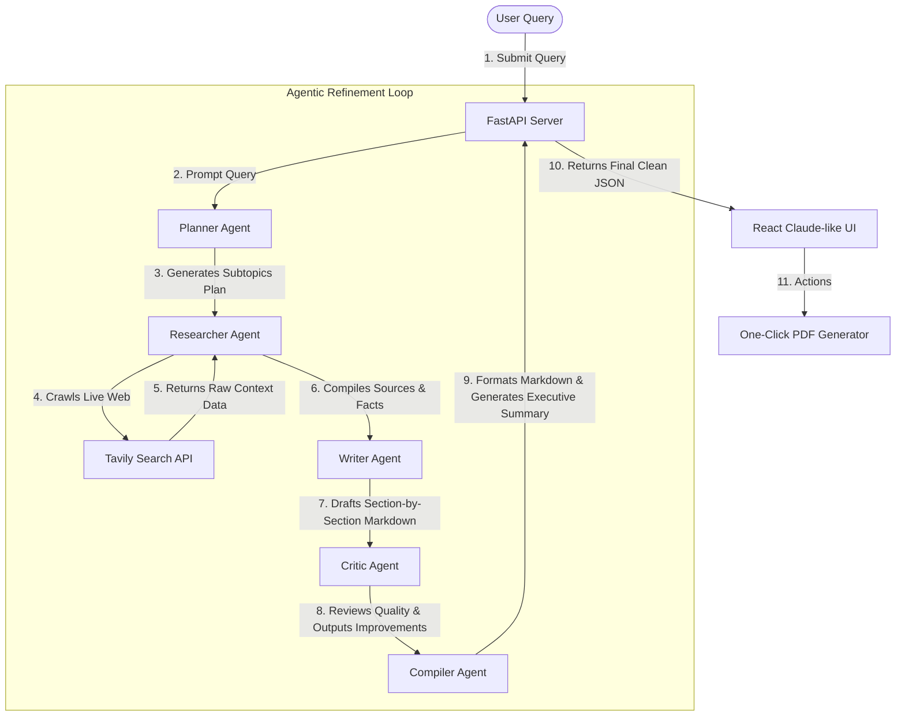

# ⚡ ResearchMind: Multi-Agent Deep Research System

[](https://github.com/Shivam8292/multiagent-research-engine)
[](LICENSE)
[](#-security--api-keys)

ResearchMind is an advanced, production-grade **Multi-Agent Deep Research System** that transforms any simple search query into a comprehensive, publication-quality research report. Powered by **Google Gemini 2.5 Flash** and the **Tavily Search API**, it orchestrates **5 autonomous, specialized AI agents** that plan, search, write, critique, and compile reports collaboratively.

---

## 🎬 Live Demonstration


---

## 🏛️ System Architecture & Workflow

ResearchMind executes queries through a highly structured **sequential assembly line workflow**. Each specialized agent processes the output of its predecessor, creating a progressive refinement loop.



### ⚙️ Asynchronous vs. Sequential Architecture:
* **Sequential Agent Flow (Data Dependency):** Within a single research run, the agents must collaborate **line-by-line (sequentially)**. The *Writer* cannot draft sections without the *Researcher's* live search results, and the *Critic* cannot critique without the *Writer's* initial draft. This sequential dependency ensures maximum logical consistency and depth.
* **Asynchronous Web Execution:** The FastAPI server handles incoming client calls asynchronously. Multiple users can submit research requests concurrently; the server processes their individual pipelines independently without locking the event loop.

---

## 🛠️ Technology Stack

| Component | Framework / Library | Purpose |
| :--- | :--- | :--- |
| **Frontend** | React 19, Vite 8, Tailwind CSS v4 | Claude-like dashboard interface, light/dark theme transition, responsive layout |
| **Backend** | Python 3.11+, FastAPI, Uvicorn | High-performance asynchronous REST API pipeline |
| **AI LLM** | Google Gemini SDK (`gemini-2.5-flash`) | Context generation, outline planning, synthesis, critique, and compiling |
| **Search Engine** | Tavily API Client | High-precision search extraction bypassing SEO spam |
| **PDF Engine** | jsPDF | Client-side, multi-page layout formatting for reports |

---

## ✨ Features

* **🎭 Premium Claude-like Workspace:** Modern, elegant left-aligned history drawer, suggestion tags, profile info, and custom action menus.
* **🌓 Dual Theme Engine:** Smooth, hardware-accelerated transitions between Light and Dark mode built on CSS Variables.
* **📈 Real-Time Agent Dashboard:** Neon-lit dynamic progress tracking showing which agent is active, pending, or completed.
* **📄 Multi-page PDF Export:** Seamlessly download clean, formatted PDFs of compiled reports with customized title layouts and bulleted references.
* **🔒 Auto-retry Resilience:** Automatic exponential backoff decorator for Gemini API requests to bypass rate limiting or temporary timeouts.

---

## 🚀 Step-by-Step Installation

### Prerequisites
* Python 3.11 or higher
* Node.js 18 or higher
* Google Gemini API Key
* Tavily Search API Key

---

### 1. Clone & Project Directory Structure
```bash
git clone https://github.com/Shivam8292/multiagent-research-engine.git
cd "multiagent research engine"
```

---

### 2. Backend Setup
1. Navigate into the backend directory and spin up a virtual environment:
   ```bash
   cd backend
   python -m venv venv
   # On Windows (PowerShell):
   .\venv\Scripts\activate
   # On Linux/macOS:
   source venv/bin/activate
   ```
2. Install dependencies:
   ```bash
   pip install -r requirements.txt
   ```
3. Create your `.env` configuration file in the `backend/` directory:
   ```env
   GEMINI_API_KEY=your_gemini_api_key_here
   TAVILY_API_KEY=your_tavily_api_key_here
   ```
4. Start the development server:
   ```bash
   uvicorn main:app --reload --port 8000
   ```
   The backend will be live on `http://127.0.0.1:8000`. You can check the OpenAPI specification at `http://127.0.0.1:8000/docs`.

---

### 3. Frontend Setup
1. Open a new terminal in the root directory and navigate to the frontend:
   ```bash
   cd frontend
   ```
2. Install Node packages:
   ```bash
   npm install
   ```
3. Start the Vite dev server:
   ```bash
   npm run dev
   ```
   The web portal will boot up on `http://localhost:5173/`.

---

## 🔒 Security & API Keys

> [!IMPORTANT]
> The environment configuration file (`.env`) contains sensitive API credentials and is **explicitly ignored** under Git control using `.gitignore` patterns. Do not commit or push `.env` files to public code repositories. If your keys are ever exposed, revoke them immediately in your Google AI Studio and Tavily consoles.

---

## 📁 Repository Structure

```
├── backend/
│   ├── agents/            # Specialized Agent Logic
│   │   ├── planner.py     # Outlining subtopics
│   │   ├── researcher.py  # Tavily Web Crawling
│   │   ├── writer.py      # Draft generation
│   │   ├── critic.py      # Quality assurance
│   │   └── compiler.py    # Refinement & formatting
│   ├── models/            # Pydantic schemas
│   ├── main.py            # FastAPI endpoints & startup
│   ├── utils.py           # Retry helpers & decorators
│   └── requirements.txt
├── frontend/
│   ├── src/
│   │   ├── components/    # Reusable UI elements (HistoryPanel, ReportView, SearchBar, etc.)
│   │   ├── App.jsx        # Core application wrapper & states
│   │   ├── index.css      # Custom CSS & Tailwind imports
│   │   └── main.jsx
│   ├── package.json
│   ├── tailwind.config.js
│   └── vite.config.js
└── docs/                  # Assets and Walkthrough files
```

---

## 👨‍💻 Developer

Developed with ❤️ by **[Shivam](https://github.com/Shivam8292)**

